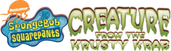

# Krusty Krab Patch

Play **SpongeBob SquarePants: Creature from the Krusty Krab** (Wii) with a
**GameCube controller** or a **Classic Controller** instead of waving a Wii
Remote and Nunchuk. Works with the USA (`RQ4E78`) and European (`RQ4P78`)
releases.

The patch is applied to your own copy of the game: drop a clean `.wbfs` or
`.iso` onto the patcher and play the result on a Wii (USB loader) or in
Dolphin. Nothing from the game is included in this repository.



## Status

Tested in Dolphin on the USA release with scripted GameCube pad input: the game
sees the pad as a Wii Remote with a Nunchuk, and buttons and the control stick
arrive where the same press would on a real pair. The patcher finds and
verifies every patch site in both the USA and European `main.dol`, and rebuilds
a USA disc image. **Not yet tested:** the Classic Controller, the European
release in Dolphin, and a real Wii.

**Known limits:**

- no pad can drive the game's pointer; the game does not use one for play
- plug the GameCube pad in **before** starting the game
- the Wii Remote's own motion gestures are not read from a pad: they are
  played back as accelerometer motion when you press their button (see below)
- other releases (the game only shipped as USA and Europe discs) and images
  already modified by something else are refused

## Controls

The game is played with a Wii Remote and a Nunchuk. The pad is presented to the
game as exactly that, so every action the game asks for has a button.

### GameCube controller

| Input | Action |
| --- | --- |
| Control stick | Nunchuk stick (move, camera) |
| A | Wii Remote A |
| B | Wii Remote B |
| X | Nunchuk C |
| Z | Nunchuk Z |
| Y | Swing the Wii Remote |
| L | Shake the Nunchuk |
| R | Thrust down (butt bounce) |
| D-pad | Wii Remote D-pad |
| Start | + |
| L + R + Start | HOME |

### Classic Controller

| Input | Action |
| --- | --- |
| Left stick | Nunchuk stick |
| A / B | Wii Remote A / B |
| X | Nunchuk C |
| ZL | Nunchuk Z |
| ZR | Wii Remote 2 |
| Y | Swing the Wii Remote |
| L | Shake the Nunchuk |
| R | Thrust down (butt bounce) |
| D-pad, + , − , HOME | The same on the Wii Remote |

Connect the Classic Controller to a Wii Remote as usual. With a Classic
Controller on a Wii U (vWii) injection, enable *Force Classic Controller
Connected*.

## Installing

### Patch your disc image

You need a clean `.wbfs` or `.iso` of the game. Run the patcher from source
(needs Python 3 with tkinter and [Wiimms ISO Tool](https://wit.wiimm.de/)
(`wit`) on your `PATH`), or use a build from the releases page:

```bash
python3 tools/gui.py
```

Drop the image onto the window (or click to choose it). The patcher checks the
disc id, patches `sys/main.dol`, rebuilds the image in the same format and
replaces your file, keeping the original next to it as `<name>.bak`.

There is a command-line twin:

```bash
python3 tools/patch_disc.py "SpongeBob SquarePants - Creature from the Krusty Krab (USA).wbfs"
```

### Gecko codes (Dolphin)

Copy `codes/<disc id>.ini` (`RQ4E78` or `RQ4P78`) into Dolphin's `GameSettings`
folder and enable the code under **Properties → Gecko Codes**. Set GameCube Port
1 to a Standard Controller (or leave it empty and use a Classic Controller).

The same code is in `codes/<disc id>.txt` in the plain layout loaders read. On
a real console with a loader's own code handler, prefer the patched disc: a
handler and the patch both want the Wii's low memory.

### Riivolution

`riivolution/<disc id>.xml` is a Riivolution patch. Put it in your Riivolution
folder (or Dolphin's `Load/Riivolution`) and enable the option. It matches on
the disc id, so it cannot be applied to the wrong release.

### Which release do I have?

The disc id is the first six characters of the disc (`RQ4E78` USA, `RQ4P78`
Europe). `tools/patch_disc.py` and the GUI read it for you; the Gecko and
Riivolution files are named by it.

## Building from source

The patcher needs only Python 3 and `wit`. The routines it injects ship
pre-assembled in `tools/prebuilt/` (checked by `tools/check.py`); with
[devkitPPC](https://devkitpro.org/) and your own `main.dol` dumps you can
rebuild them from `src/`:

```bash
KRUSTY_DOLS=/dir/with/RQ4E78.dol,RQ4P78.dol python3 tools/gen_prebuilt.py
python3 tools/build.py        # regenerate codes/ and riivolution/
python3 tools/check.py        # consistency checks (no game files needed)
KRUSTY_DOLS=... python3 tools/verify.py   # checks the patch against the retail DOLs
```

To patch a `main.dol` directly:

```bash
python3 tools/patcher.py <retail main.dol> <patched main.dol> --pad
```

How the patch works is in [docs/TECHNICAL.md](docs/TECHNICAL.md).

## Credits

- The Gecko / WiiRD community for the code format and code handler.
- [New Classic Controller hacks](https://gbatemp.net/threads/new-classic-controller-hacks.659837/)
  on GBAtemp, the idea this patch follows.

## Contact

quatricsoftware@gmail.com

No support will be provided for this tool.

## License

MIT — see [LICENSE](LICENSE).

Copyright (c) 2026 quatric

### Modded images

Disc patchers match the first four characters of the game ID (ID4), so mods can change the last two characters. The original disc ID and filename are preserved. Revision and executable patch-site checks still apply; mods that change required code may be incompatible.
